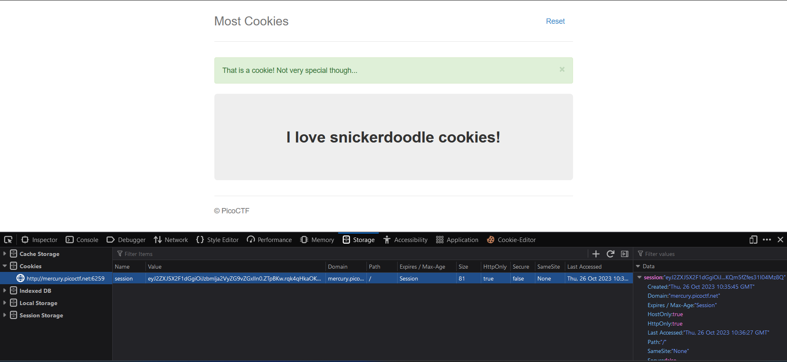
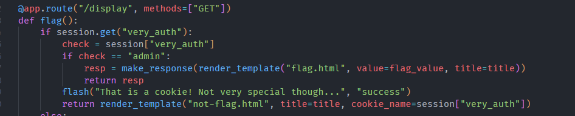
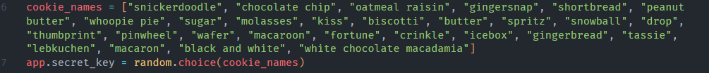
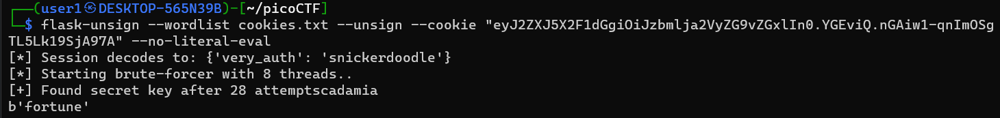
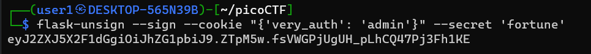
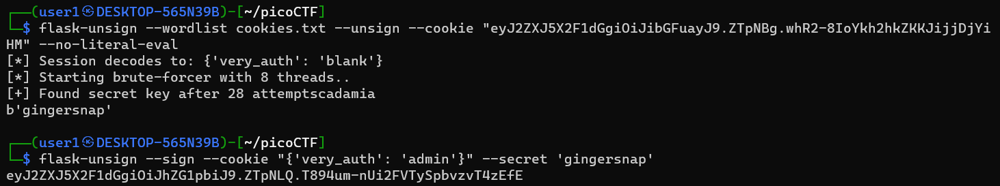
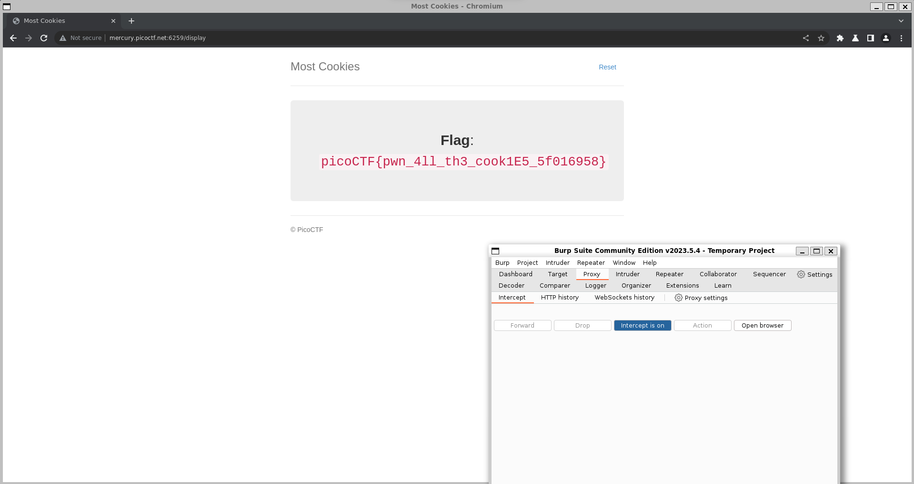

# Most Cookies

First approach was the fact that the name has cookies written all over it was to check the cookies. So opening the website and checking the storage



Looking at it, best guess was that it was base64 so put it in base64decoder.org (sorry, not sorry) we got the decode as `{"very_auth":"snickerdoodle"}NJh}783?`

leaving the text after the period, it seems the before part is a json embedded into the cookie. now examining the code we see it deals with this part only



this means that if we keep the last part and change in the json to "admin" and send it, we should get the flag.

So to intercept I am using burpsuite. changing and sending this cookie
```
{"very_auth":"admin"}
eyJ2ZXJ5X2F1dGgiOiJhZG1pbiJ9.YGEviQ.nGAiw1-qnImOSgTL5Lk19SjA97A
```

well it doesn't work, it immediately redirects a blank cookie again again not accepting the cookie send.

So after googling a lot, finding out that flask session cookies are actually parsed with a cryptic hash ([article](https://blog.paradoxis.nl/defeating-flasks-session-management-65706ba9d3ce)). So i need to find a secret key to decode. THIS TOOK AN HOUR but i forgot to check in the code there was a line that sets the secret key randomly to one of the cookies



now had to google how to decode and encode flask session keys and a found this pip library called [flask-unsign](https://book.hacktricks.xyz/network-services-pentesting/pentesting-web/flask). Also it had a command already to decode flask cookies as well so this was the tool to find out. There is also an option to brute force with options in a text file, so i enter all the cookie names to a text file and try to brute force it.


now we use this secret key to encode our initial json we were trying to send


now trying to intercept, but realization that it uses random cookie name every new session. so I open a session and this time find the secret key and encode a new cookie


sending that multiple times IT FINALLY GAVE IN!!!!!!!!!


