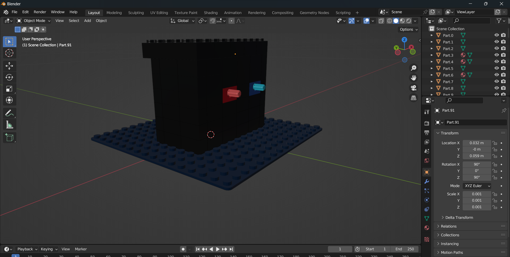
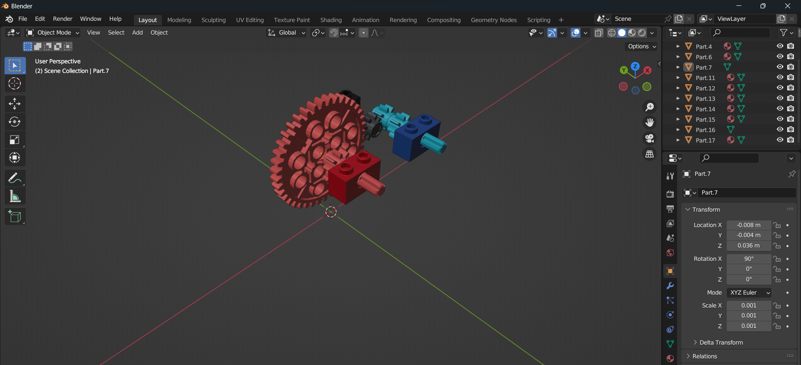

# Virtual Machine 0

Given a .dae and a input text. First google what is .dae file and what does it do. Find out it is basically storing 3d objects and can be imported into a 3d editing software. Fortunately have blender installed. Opening it.



Alright we have been told red is input and blue is output. So we need to know how this works. It seems they are lego blocks so try to delete all the unnecessary blocks out



We have a gear mechanism. At first I was confused what was happening or I have to animate this or something. See the hint and it is told to just get the mathematical realation. Meaning we just have to calculate the gear relation. Fortuanetly have done a Mechanical eng. intro course in college.

Now presuming that we are turning the axle by the given input and reading how many times the other axle turned. We can see the number of teeth on each gear and make a relation with number of turns.


Alright now we count the number of teeth in each gear


That's `40:8 = 5:1` So the number of turns increases by 5. So our output is basically input times 5. So we take the input, multiply it by 5 and convert it into bytes.

```python
from Crypto.Util.number import long_to_bytes
inputCipher = "39722847074734820757600524178581224432297292490103996086521425478666370329"
print(long_to_bytes(inputCipher*5).decode())
```
```
picoCTF{g34r5_0f_m0r3_cef8e141}
```
