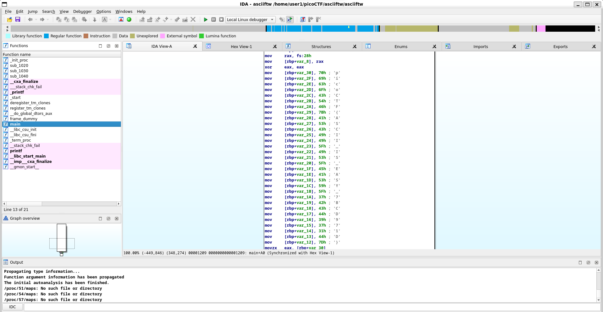

# ASCII FTW

given an ELF binary file, trying to chmod and run it we get this output
```
└─$ ./asciiftw
The flag starts with 70
```
opening the binary in IDA and search for 70 we find the flag in ascii being mov



`picoCTF{ASCII_IS_EASY_7BCD971D}`