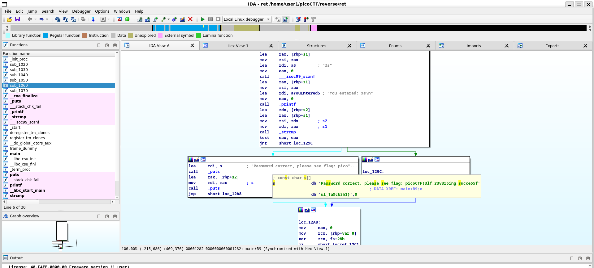

# Reverse

Recieved an ELF binary called ret. Opened in IDA and found it stores a conditional for if a password is correct if so print flag if not return. And we can observe what the flag itself is.

`picoCTF{3lf_r3v3r5ing_succe55ful_fa9cb3b1}`