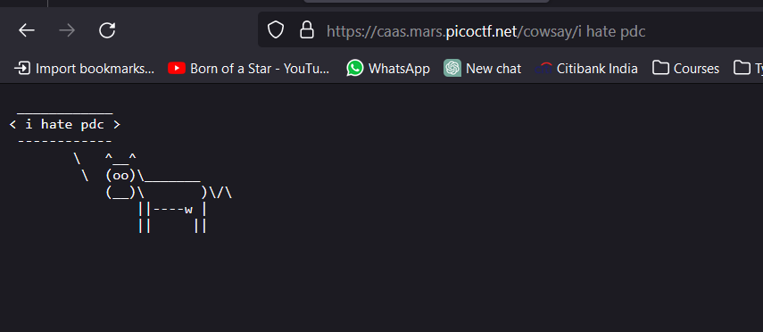
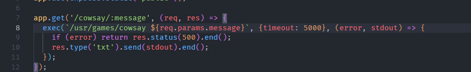
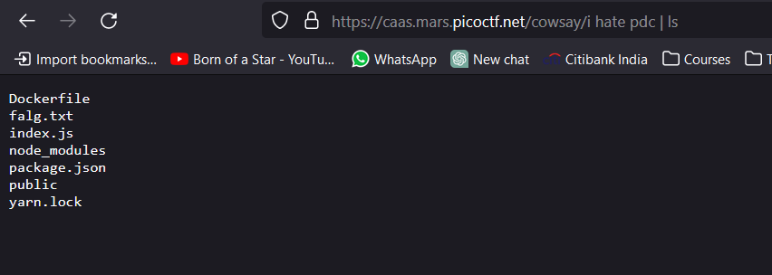
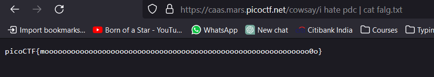

# CAAS

program to use cowsay on pc. you can edit the routes to perform

we are given a index.js file as well attached. observing that we see that one command sticks out that is exploitable that is that this route is used to execute a command in the terminal

so we can try to use the pipe operator and add another command

so we see what is inside the falg.txt

